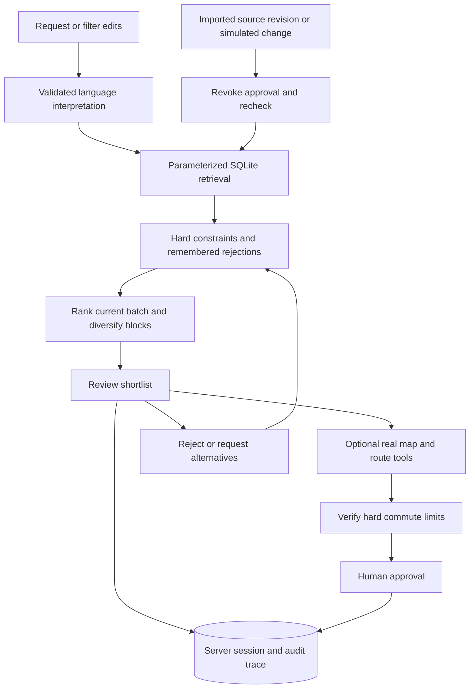

# PropMatch Agent

**Find an HDB home, explore its neighbourhood, and build a shortlist that adapts to your feedback.**

303forward · Team code **D1IZFT7E** · NUS-ISS Show Me Your Agents Hackathon
[Live Lightsail demo](https://propmatch-18-142-198-52.sslip.io/) · [GitHub](https://github.com/Skylarrr333/Show-me-your-agent) · branch **main**

The live demo uses a private team/judge access password. Model keys and access credentials are never included in this repository.

## Current product — 26 September 2026

The main page starts with a single request box. Filters and commute preferences expand when needed. Results offer a shortlist, alternatives and remembered rejections; favourites have their own **Saved** page. Each home has **The home** and **Map & everyday journeys** tabs. Tool execution summaries are collapsed under **How your shortlist was built**. This release focuses on the desktop experience.

[中文使用指南](docs/USER_GUIDE_ZH.md) · [数据与导入](docs/HDB_DATA_ZH.md) · [架构说明](docs/ARCHITECTURE_ZH.md) · [Lightsail runbook](deployment/LIGHTSAIL_RUNBOOK.md)

| Capability | Implemented behavior |
|---|---|
| Language model | Organiser Claude gateway, DeepSeek or direct Bedrock; structured extraction validated with Zod. Form-only queries make no model call. No local LLM training needed. |
| Housing dataset | Pinned Kaggle v1 archive, **228,225 historical HDB transactions**, 26 towns, Jan 2017–Apr 2026. Reproducible checksum-verified SQLite import. |
| Retrieval | Parameterized SQL for price, area in m², town, flat type, street and reference month. Latest comparable selected before buyer filtering. No vector retrieval or embeddings. |
| Stateful agent | Shared server session, typed tool execution, constraint checks, transparent batch ranking, feedback memory, human approval and source-change redecision. |
| Feedback | Reject with a reason, replace a shortlist and save homes. Alternatives advance to unseen groups and another database page when needed. |
| Maps | Verified OneMap block coordinates; Leaflet/OSM map; selectable MRT, bus stops, parks, schools, food, shops and healthcare markers within 1 km. |
| Routes | Real road-network walking/driving routes and estimated minutes from FOSSGIS OSRM, drawn on the map. **No live traffic.** Transit opens Google Maps; no in-app transit duration claimed. |
| Hard commute limits | Optional bounded route check for a shortlist and a few alternatives. Unknown, failed or over-limit routes cannot be approved. Not an exhaustive commute search over the full database. |
| Changes | Session-local simulated withdrawal / price rise recomputes the shortlist and revokes approval. New imported dataset versions trigger redecision; no real listing withdrawal detector. |
| Hosting | Next standalone Docker on AWS Lightsail; Caddy HTTPS + Basic access; persistent sessions. Database is generated in the image build and checked by health probes. |

**Evidence boundaries:** the homes are representative groups of historical transactions, not identified available units. Reference prices are not asking prices or valuations. Availability events are simulations. Bedroom counts, sellers and photos are absent. Map evidence is retrieved separately. A short route does not establish housing eligibility, and approval sends no message or booking.

## Run locally

Prerequisites: **Node.js 22.13+**, npm, **Python 3.10+** (standard library only for import).

```bash
npm ci
npm run data:hdb
cp .env.example .env.local
npm run dev:next
```

Open [localhost:3000](http://localhost:3000). `.env.example` defaults to **demo** mode without paid model calls. Use forms or the basic English example offline. Full bilingual interpretation needs a live provider; map lookups need internet access.

For the organiser model, edit only your private `.env.local`:

```dotenv
LLM_MODE=gateway
LLM_GATEWAY_URL=https://api.softwaresystems.app
LLM_GATEWAY_API_KEY=your_team_key_here
LLM_MODEL=global.anthropic.claude-sonnet-4-5-20250929-v1:0
```

Do not commit `.env.local`, personal DeepSeek keys, SSH keys, website passwords or `.propmatch-sessions/`. Teammates can run form/demo searches from the repository without any secrets. [Additional provider setup](docs/LIVE_SETUP_ZH.md).

Production build:

```bash
npm run data:hdb
npm run build:next
npm run start:next
```

`HDB_RESALE_DB` overrides the default `.propmatch-data/hdb-resales.sqlite`. `SESSION_DIR` controls session storage. An empty or missing database fails clearly instead of silently substituting mock data.

## Data reproducibility and attribution

[HDB resale pricing (Singapore) by yingghui233, Kaggle](https://www.kaggle.com/datasets/yingghui233/hdb-resale-pricing-singapore) is pinned as `data/hdb/kaggle-v1.zip`. `npm run data:hdb` verifies the extracted CSV SHA-256, checks all rows and builds indexed `resales` and `homes` tables atomically. [Manifest and license boundary](data/hdb/README.md).

The source license label is **Unknown**. The archive is retained in this team's private repository for the requested reproducible handoff; this project does not grant a separate data license or claim permission for public redistribution/commercial reuse. It is not served from `public/`.

The previous 7,295-record official HDB snapshot remains available to the legacy market-comparison tool. It is separate from the new homepage's Kaggle dataset. The 72 original synthetic fixtures remain for legacy API regression tests; they no longer power the homepage.

## Agent architecture



This is one bounded stateful orchestrator with typed tools, not an unrestricted or multi-agent system. The model interprets intent; code decides allowed operations and exact SQL, preserves numeric limits, enforces evidence checks and requires approval. No hidden chain of thought is exposed. Replanning after source changes needs no new model call.

Ranking is transparent and limited to the **loaded batch**, usually 20 groups: `60 + min(25, budget headroom %) + min(15, area m² / 10)`. Verified hard commute results take priority; distinct blocks are preferred in the initial trio. This is a prototype comparison score, not a valuation or a learned global optimal ranking. The experimental CPU ranker in `training/` is not used by this workflow.

## Maps and service limits

- [OneMap API](https://www.onemap.gov.sg/apidocs/) resolves exact matching block/road addresses. Unmatched blocks remain unknown. OneMap search was verified without authentication; optional `ONEMAP_ACCESS_TOKEN` can be supplied if access requirements change.
- [OpenStreetMap](https://www.openstreetmap.org/copyright) supplies map tiles and POIs via [Overpass](https://wiki.openstreetmap.org/wiki/Overpass_API). Attribution stays visible. Browser tile caching is preserved; no prefetch/offline tile download.
- [FOSSGIS routing](https://routing.openstreetmap.de/about.html) supplies walking/driving road routes. Requests per provider are serialized at less than one per second across a **single app process**, cached in memory, limited to user-triggered lookups and bounded candidate checks. Do not horizontally scale this public-service configuration without a shared quota/cache or your own provider.
- [OSM tile usage policy](https://operations.osmfoundation.org/policies/tiles/) applies. No availability SLA is claimed. Provider URLs are configurable on the server; `NEXT_PUBLIC_MAP_TILE_URL` is a build-time browser setting.
- Nearby distances are **straight-line distances**, not walk times. Route geometry/minutes are from OSRM, not a straight-line estimate. Driving has no live traffic; transit schedules and MRT/bus duration are only available on the linked external map.

## Quality checks

```bash
npm run lint
npm run typecheck
npm test
npm run eval
npm run build:next
npm run build
```

Tests include source freshness and failures, approvals, rejection persistence, alternative replacement, SQL injection, budget anchors, unsupported requirements, hard commute failures and simulated withdrawal/price changes. CI imports the pinned database, runs checks and both builds, builds the production container and exercises authenticated HTTPS workflows plus restart persistence. External model/map calls are opt-in; unit tests use controlled test evidence.

The release and map-resilience verification passed **81 unit tests** (including two temporary-provider-failure cases), **15 legacy evaluation cases**, lint, type checking and production builds. One organiser-gateway request and actual OneMap/Overpass/OSRM interactions were also checked separately. See [the dated verification record](docs/HOME_RELEASE_VALIDATION_2026-09-26.md) for scope and limitations.

Map HTTP 502/503/504 responses get one bounded automatic retry. If a lookup still fails, the UI identifies the affected service and retains the verified block and previously loaded evidence, with an explicit warning that the failed lookup did not refresh it. **Show map only**, **Retry lookup** and Google Maps links provide separate recovery paths. These measures do not guarantee upstream service availability.

## Deployment

```bash
# Populate .env from .env.example with server-only credentials and access settings.
docker compose --profile https up -d --build
```

The Docker data stage imports the checked-in archive. The runtime user reads `/app/data/hdb-resales.sqlite`; the persistent session volume is separate. Health checks verify the HDB API, so a container without its dataset cannot be considered ready. Use the [Lightsail runbook](deployment/LIGHTSAIL_RUNBOOK.md) for HTTPS credentials, fixed IP and rollback.

`/api/status` reports the running commit, model configuration presence, homepage dataset readiness and the separate legacy fixture mode. Configuration presence alone is not proof that a model call succeeded. The verification command checks release identity and can exercise the homepage without paid inference:

```bash
node --env-file=.propmatch-data/lightsail/deployment-check.env --import tsx scripts/verify-deployment.ts --homes
```

The `deployment-check.env` file is private and is not part of the handoff.

## Repository guide for teammates

| Work | Start here |
|---|---|
| Homepage / UI | `components/home-finder.tsx`, `app/globals.css` |
| Agent and feedback | `agents/home-agent.ts`, `lib/home-schema.ts`, `schemas/index.ts` |
| Database / retrieval | `lib/resale-store-runtime.ts`, `lib/resale-query.ts`, `scripts/prepare-hdb.py`, `scripts/import-kaggle-hdb.py` |
| Maps / commute | `lib/maps.ts`, `components/home-map-panel.tsx`, `components/home-map.tsx`, `app/api/homes/map/route.ts` |
| Model integration | `providers/home-prompt.ts`, `providers/gateway.ts`, `providers/deepseek.ts`, `providers/bedrock.ts` |
| Server persistence | `lib/http.ts`, `lib/store-runtime.ts`, `app/api/session/route.ts` |
| Validation / operations | `tests/home-agent.test.ts`, `scripts/verify-deployment.ts`, `Dockerfile`, `docker-compose.yml`, `.github/workflows/ci.yml` |

The legacy workspace and `/api/run`, `/api/action`, `/api/compare` remain for existing sessions/regression tests; the homepage uses the shared session and trace infrastructure with an HDB-specific agent path. Cloudflare adapters are retained and build-tested, but importing the new dataset into D1 and deploying that target are not part of this Lightsail release.

## Competition handoff

Show the complete loop: enter a brief → inspect evidence → check a map/route → reject a home → view replacements → approve → simulate withdrawal → observe revoked approval and updated choices. Explain historical simulation versus real map evidence explicitly.

The repository contains earlier proposal/write-up materials. These must be updated to match this release before final PDF/video submission. No final recorded video, submitted Slack post or measured business time-saving study is claimed.
