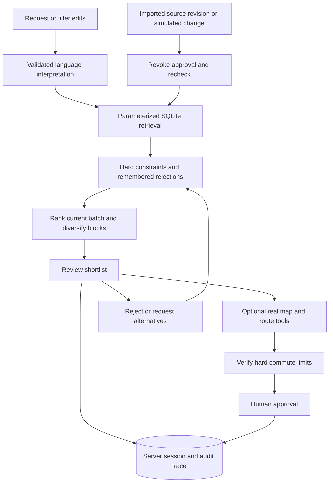

# PropMatch Agent

**Find an HDB home, explore its neighbourhood, and build a shortlist that adapts to your feedback.**

303forward · Team code **D1IZFT7E** · NUS-ISS Show Me Your Agents Hackathon
[Live Lightsail demo](https://propmatch-18-142-198-52.sslip.io/) · [GitHub](https://github.com/Skylarrr333/Show-me-your-agent) · branch **main**

The live demo uses a private team/judge access password. Model keys and access credentials are never included in this repository.

## Current product — 26 September 2026

The main page starts with a single request box. Filters and commute preferences expand when needed. Results offer a shortlist, alternatives and remembered rejections; favourites have their own **Saved** page. Each home has **The home** and **Map & everyday journeys** tabs. Tool execution summaries are collapsed under **How your shortlist was built**. This release focuses on the desktop experience.

[中文使用指南](docs/USER_GUIDE_ZH.md) · [数据与导入](docs/HDB_DATA_ZH.md) · [架构说明](docs/ARCHITECTURE_ZH.md) · [Lightsail runbook](deployment/LIGHTSAIL_RUNBOOK.md)

| Capability | Implemented behavior |
|---|---|
| Language model | Organiser Claude gateway, DeepSeek or direct Bedrock; structured extraction validated with Zod. Form-only queries make no model call. No local LLM training needed. |
| Housing dataset | Separately obtained Kaggle v1 archive (not included in this repository), **228,225 historical HDB transactions**, 26 towns, Jan 2017–Apr 2026. Reproducible checksum-verified SQLite import, plus three separately labelled complete fictional listing demos for product walkthroughs. |
| Retrieval | Parameterized SQL for price, area in m², town, flat type, street and reference month. Latest comparable selected before buyer filtering. No vector retrieval or embeddings. |
| Stateful agent | Shared server session, typed tool execution, constraint checks, transparent batch ranking, feedback memory, human approval and source-change redecision. |
| Feedback | Reject with a reason, replace a shortlist and save homes. Alternatives advance to unseen groups and another database page when needed. |
| Maps | OneMap GreyLite basemap; exact block lookup, nearby MRT/LRT and bus stops, selected official facility layers within 1 km. Home / Nearby / Journey views; keyless Open Google Maps links. |
| Routes | OneMap walking/driving estimates and scheduled MRT/bus itineraries, with map paths and transit steps. Current route evidence supports Agent commute limits. **No live traffic or guaranteed arrival times claimed.** |
| Hard commute limits | Optional bounded route check for a shortlist and a few alternatives. Unknown, failed or over-limit routes cannot be approved. Not an exhaustive commute search over the full database. |
| Changes | Session-local simulated withdrawal / price rise recomputes the shortlist and revokes approval. New imported dataset versions trigger redecision; no real listing withdrawal detector. |
| Hosting | Next standalone Docker on AWS Lightsail; Caddy HTTPS + Basic access; persistent sessions. Database is generated in the image build and checked by health probes. |

**Evidence boundaries:** historical homes are representative groups of transactions, not identified available units. Reference prices are not asking prices or valuations. The three records in `lib/demo-listings.ts` are explicitly fictional complete-listing demonstrations: their unit numbers, availability, seller/agent details and prices are not real, and their Unsplash images are illustrative. Map evidence is retrieved separately at block level. A short route does not establish housing eligibility, and approval sends no message or booking.

## Run locally

Prerequisites: **Node.js 22.13+**, npm, **Python 3.10+** (standard library only for import), and a separately obtained Kaggle version 1 archive. The repository does **not** include this dataset. After checking the source permissions, place your local archive at `data/hdb/kaggle-v1.zip` before running the commands below; Git ignores this file. See the [dataset manifest](data/hdb/README.md) for the source and expected checksum.

```bash
npm ci
npm run data:hdb
cp .env.example .env.local
npm run dev:next
```

Open [localhost:3000](http://localhost:3000). `.env.example` defaults to **demo** mode without paid model calls. Use forms or the basic English example offline. Full bilingual interpretation needs a live provider; map lookups need internet access.

For the organiser model, edit only your private `.env.local`:

```dotenv
LLM_MODE=gateway
LLM_GATEWAY_URL=https://api.softwaresystems.app
LLM_GATEWAY_API_KEY=your_team_key_here
LLM_MODEL=global.anthropic.claude-sonnet-4-5-20250929-v1:0
```

Do not commit `.env.local`, personal DeepSeek keys, SSH keys, website passwords or `.propmatch-sessions/`. After supplying and importing the dataset, teammates can run form/demo searches without model credentials. [Additional provider setup](docs/LIVE_SETUP_ZH.md).

Production build:

```bash
npm run data:hdb
npm run build:next
npm run start:next
```

`HDB_RESALE_DB` overrides the default `.propmatch-data/hdb-resales.sqlite`. `SESSION_DIR` controls session storage. An empty or missing database fails clearly instead of silently substituting mock data.

## Data reproducibility and attribution

[HDB resale pricing (Singapore) by yingghui233, Kaggle](https://www.kaggle.com/datasets/yingghui233/hdb-resale-pricing-singapore) version 1 is the expected external input at `data/hdb/kaggle-v1.zip`; the archive and its extracted CSV are **not included in this repository**. `npm run data:hdb` verifies the extracted CSV SHA-256, checks all rows and builds indexed `resales` and `homes` tables atomically. [Manifest and license boundary](data/hdb/README.md).

The source license label recorded at download was **Unknown**. Obtain the dataset separately from its source and check the applicable permissions. This project does not grant a separate data license or claim permission for public redistribution/commercial reuse. The dataset is not served from `public/`.

The previous 7,295-record official HDB snapshot remains available to the legacy market-comparison tool. It is separate from the new homepage's Kaggle dataset. The 72 original synthetic fixtures remain for legacy API regression tests; they no longer power the homepage.

### Dataset removal and Git history cleanup — 27 September 2026

`data/hdb/kaggle-v1.zip` was removed from the repository and its branch history using `git-filter-repo`. At cleanup time the repository had one branch (`main`) and no tags. The cleanup used a separate mirror clone and a local backup outside the repository:

```bash
git filter-repo --invert-paths --path data/hdb/kaggle-v1.zip
```

The rewritten `main` history and this documentation update were pushed with an explicit `--force-with-lease` against the previously recorded remote commit. Verification checked every reachable commit for the path and confirmed that the original ZIP blob was no longer reachable. The `.gitignore` exception for this archive was removed to prevent accidental recommits.

**Existing contributors should make a fresh clone.** Preserve any uncommitted work separately and reapply only the needed changes; merging or pushing old history can restore the removed dataset. History rewriting does not erase other people's clones, forks or GitHub cached commit views; see [GitHub's history-removal documentation](https://docs.github.com/en/authentication/keeping-your-account-and-data-secure/removing-sensitive-data-from-a-repository).

The import scripts, checksum and provenance documentation remain. Local imports and Docker builds require the archive to be supplied separately. A fresh clone can run the default code checks without it; the optional HDB integration job provisions external data before `npm run data:hdb` as described below. The separate legacy HDB snapshot and synthetic fixtures described above are unchanged.

## Agent architecture



This is one bounded stateful orchestrator with typed tools, not an unrestricted or multi-agent system. The model interprets intent; code decides allowed operations and exact SQL, preserves numeric limits, enforces evidence checks and requires approval. No hidden chain of thought is exposed. Replanning after source changes needs no new model call.

Ranking is transparent and limited to the **loaded batch**, usually 20 groups: `60 + min(25, budget headroom %) + min(15, area m² / 10)`. Verified hard commute results take priority; distinct blocks are preferred in the initial trio. This is a prototype comparison score, not a valuation or a learned global optimal ranking. The experimental CPU ranker in `training/` is not used by this workflow.

## Maps and service limits

- [OneMap GreyLite](https://www.onemap.gov.sg/docs/maps/greylite.html) renders a clean, attributed Singapore basemap. Address matching requires the requested block and road. No approximate home coordinate is substituted.
- Configure server-only `ONEMAP_EMAIL` and `ONEMAP_PASSWORD` after verifying your OneMap account. The server manages access-token renewal; no credentials appear in the browser or Git. [Setup and deployment guide](docs/ONEMAP_SETUP_ZH.md).
- [OneMap routing](https://www.onemap.gov.sg/apidocs/routing) supplies walking, driving and scheduled public transport. Transit queries depart now in Singapore time, selecting the earliest arrival among up to three returned itineraries and including initial waiting. Displayed resolved destinations need user review. Road estimates expire after one hour; transit after five minutes. Unknown, stale or over-limit evidence cannot pass a hard commute limit.
- [Nearby Transport](https://www.onemap.gov.sg/apidocs/nearbytransport) supplies MRT/LRT and bus stops. [Themes](https://www.onemap.gov.sg/apidocs/themes) supply supported park, education, hawker, shopping and healthcare point layers where available in the current catalog. Coverage is not complete. Distances are straight-line, not walk times; partial failures and missing layers remain visible. No inferred polygon entrances or invented points.
- Requests are serialized at under one per second in a single process, with bounded retries, typed validation and memory caching. HTTP 200 error envelopes are rejected. Cached evidence retains its actual retrieval time. API quota and network failures remain possible.
- [Google Maps links](https://developers.google.com/maps/documentation/urls/get-started) open the selected location/category/journey externally without a key. This version calls no Google Embed, Places, Routes or JavaScript API and no OSRM/Overpass services.

## Quality checks

```bash
npm run lint
npm run typecheck
npm test
npm run eval
npm run build:next
npm run build
```

Tests include source freshness and failures, approvals, rejection persistence, alternative replacement, SQL injection, budget anchors, unsupported requirements, hard commute failures and simulated withdrawal/price changes. On every push and pull request, CI runs the production dependency audit, lint, type checking, unit tests, legacy evaluations and both builds without the external Kaggle dataset. Database unit tests create temporary test fixtures. HDB import and production-container validation are separate, opt-in integration checks; a green default CI run does not claim those checks passed. External model/map calls are opt-in; unit tests use controlled test evidence.

To run the full HDB integration checks:

1. Set the repository Actions secret `HDB_DATASET_URL` to an authorized HTTPS URL that downloads the exact Kaggle v1 ZIP (a signed download URL is supported). The source is external; do not add the archive back to Git.
2. Open **Actions → Quality gates → Run workflow**, select the branch to verify and enable `run_hdb_integration`.
3. After the normal code checks pass, the `hdb-integration` job downloads the archive on its runner, verifies the existing CSV SHA-256, imports the database, builds the production container and exercises authenticated HTTPS workflows plus restart persistence. It does not upload the dataset or image as an artifact. A missing secret, failed download or checksum mismatch fails the requested integration job instead of silently skipping it.

The release and map-resilience verification passed **81 unit tests** (including two temporary-provider-failure cases), **15 legacy evaluation cases**, lint, type checking and production builds. One organiser-gateway request and actual OneMap/Overpass/OSRM interactions were also checked separately. See [the dated verification record](docs/HOME_RELEASE_VALIDATION_2026-09-26.md) for scope and limitations.

The dated 81-test record above describes the preceding release. OneMap migration validation is recorded separately in `docs/ONEMAP_VALIDATION_2026-09-26.md`; unit-test fixtures are distinguished from actual provider checks. External Google Maps links remain available when OneMap is unavailable.

## Deployment

```bash
# Populate .env from .env.example with server-only credentials and access settings.
docker compose --profile https up -d --build
```

The Docker data stage imports the separately supplied local archive from `data/hdb/kaggle-v1.zip`. Place it in the build context before running Docker; it is not included in Git. The runtime user reads `/app/data/hdb-resales.sqlite`; the persistent session volume is separate. Health checks verify the HDB API, so a container without its dataset cannot be considered ready. Use the [Lightsail runbook](deployment/LIGHTSAIL_RUNBOOK.md) for HTTPS credentials, fixed IP and rollback.

`/api/status` reports the running commit, model configuration presence, homepage dataset readiness and the separate legacy fixture mode. Configuration presence alone is not proof that a model call succeeded. The verification command checks release identity and can exercise the homepage without paid inference:

```bash
node --env-file=.propmatch-data/lightsail/deployment-check.env --import tsx scripts/verify-deployment.ts --homes
```

The `deployment-check.env` file is private and is not part of the handoff.

## Repository guide for teammates

| Work | Start here |
|---|---|
| Homepage / UI | `components/home-finder.tsx`, `app/globals.css` |
| Agent and feedback | `agents/home-agent.ts`, `lib/home-schema.ts`, `schemas/index.ts` |
| Database / retrieval | `lib/resale-store-runtime.ts`, `lib/resale-query.ts`, `scripts/prepare-hdb.py`, `scripts/import-kaggle-hdb.py` |
| Maps / commute | `lib/maps.ts`, `lib/onemap-client.ts`, `lib/google-maps.ts`, `components/home-map-panel.tsx`, `components/home-map.tsx`, `app/api/homes/map/route.ts` |
| Model integration | `providers/home-prompt.ts`, `providers/gateway.ts`, `providers/deepseek.ts`, `providers/bedrock.ts` |
| Server persistence | `lib/http.ts`, `lib/store-runtime.ts`, `app/api/session/route.ts` |
| Validation / operations | `tests/home-agent.test.ts`, `scripts/verify-deployment.ts`, `Dockerfile`, `docker-compose.yml`, `.github/workflows/ci.yml` |

The legacy workspace and `/api/run`, `/api/action`, `/api/compare` remain for existing sessions/regression tests; the homepage uses the shared session and trace infrastructure with an HDB-specific agent path. Cloudflare adapters are retained and build-tested, but importing the new dataset into D1 and deploying that target are not part of this Lightsail release.

## Competition handoff

Show the complete loop: enter a brief → inspect evidence → check a map/route → reject a home → view replacements → approve → simulate withdrawal → observe revoked approval and updated choices. Explain historical simulation versus real map evidence explicitly.

The repository contains earlier proposal/write-up materials. These must be updated to match this release before final PDF/video submission. No final recorded video, submitted Slack post or measured business time-saving study is claimed.
