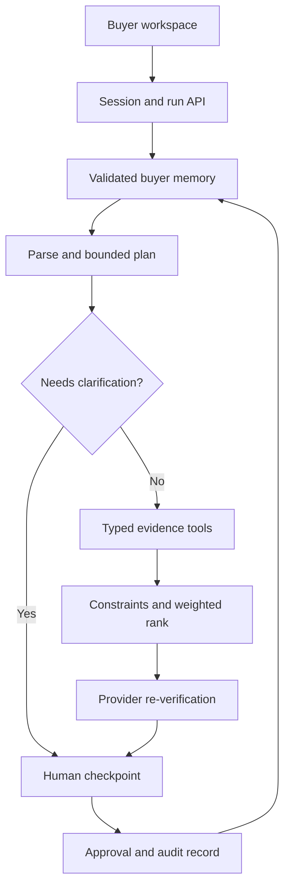

# Architecture

## Runtime boundary

The repo contains one React / TypeScript App Router application and two deployment targets. Next standalone runs on a Lightsail VM in Docker. Vinext compiles the same routes to a Sites Worker, mapping `lib/store-runtime` to a D1 adapter. This separates deployment mechanics from domain behavior; neither ranking nor constraints depends on the host.

## Orchestrator

`agents/orchestrator.ts` owns the run. `LLMProvider.parse` receives only the current structured buyer profile and current message, never listing descriptions. `LLMProvider.plan` proposes tool names from a bounded enum. The orchestrator reconciles that plan with deterministic minimum evidence requirements, executes allowed tools and emits concise factual trace events as each action completes. It is a single stateful agent with deterministic tools, not multiple agents exchanging unvalidated text.

Demo mode uses the deterministic `DemoLLMProvider`. Bedrock mode uses the documented AWS Converse envelope, strict JSON parsing and Zod. Tool selection is adaptive to state in both modes: only requested routes/categories are fetched. A model cannot omit verification, bypass required evidence or call arbitrary functions. The live planner proposal is advisory inside this safety boundary; it is not unconstrained autonomous execution.

## State

`schemas/index.ts` defines the complete BuyerProfile and Session. Hard/soft descriptions are regenerated from numeric/typed fields, never treated as executable policy. Each turn appends messages and a run ID; trace records field diffs, plan, inputs, outputs, constraint decisions, scores, sources, human decisions and errors. State commits once the run completes. Failed model/tool runs retain the previous profile and remove unreviewed recommendations. Contradictory updates retain the prior valid profile and require clarification.

Node persistence uses private files, atomic rename and an exclusive short-lived write lock. D1 persistence uses a generated schema migration, prepared statements and `UPDATE ... WHERE version = ?`; runtime code does not create tables. The cookie is an unguessable session capability with HttpOnly and SameSite=Strict. HTTPS uses Secure. A stale concurrent request receives HTTP 409; no last-writer-wins overwrite is allowed. The streamed trace becomes durable at final commit; a process crash during a run can lose that in-flight trace, and the browser reports an incomplete stream instead of displaying a false success.

## Ranking model

The code first rejects ineligible listings. Scores are bounded to [0,100], rounded, then combined using a weighted mean of active dimensions. Displayed percentages represent fit scores, not statistical confidence.

| Dimension | Calculation | Active weight |
|---|---|---|
| Budget | clamp(75 + (1 - price / budget.max) × 100) | 15 |
| Property | clamp(85 + extra bedrooms × 10) | 10 |
| Commute | destination-priority-weighted mean of clamp(115 - travelMinutes × 1.3) | 25 if destinations exist |
| Transport | clamp(106 - MRT walking minutes × 5) | 20 for no-car/explicit MRT limit; otherwise 10 |
| Lifestyle | mean of requested quietness index and clamp(105 - park meters / 20); missing parks score 0 | 15 when quiet/parks requested |
| Location | 100 when preferred area matches, otherwise 50 | 10 when preferred areas exist |
| Amenities | fraction of requested food/shopping/schools/nightlife categories found | 5 when requested |

Overall = round(sum(component × active weight) / sum(active weights)). Ties break by price, then listing ID. A final source re-read removes listings changed since search. The first three become the proposed shortlist, with up to eight current candidates available for alternatives. Approval triggers a fresh source check again.

## Tool schemas and evidence

Every tool has strict Zod input and output schemas in `tools/index.ts`; the provider can only satisfy its narrow read contract. Commute and amenity outputs include confidence and provenance. Every recommendation includes a listing ID, source, updatedAt and evidence strings. Description text is untrusted and excluded from the model context; suspicious description strings produce a quarantine event and never influence scoring. No browser HTML is rendered from provider strings.

## Modes and deliberate limits

The dataset is fixed at 72 fictional rows. Fixture freshness uses 2026-09-09 as a reference clock to keep future rehearsals reproducible; live records use the actual clock. Replacing providers requires updating dependency composition, the approval provider, and adding contract tests. A real routing provider must supply verified durations. Local heuristic routes cannot establish real-world travel guarantees. Free-text preferences not representable in the schema are clarified or remain non-scoring notes; they must not be represented as satisfied constraints.

The demo parser supports the documented English examples, shared-currency budget ranges, area exclusions and supported commute limits. Bedrock broadens language understanding, while independent extraction anchors numeric edits and deterministic checks protect nonnumeric hard constraints. Unsupported mandatory subjective requirements trigger clarification. Explanations remain deterministic and grounded in both modes. No external messaging or transactional tool exists.
