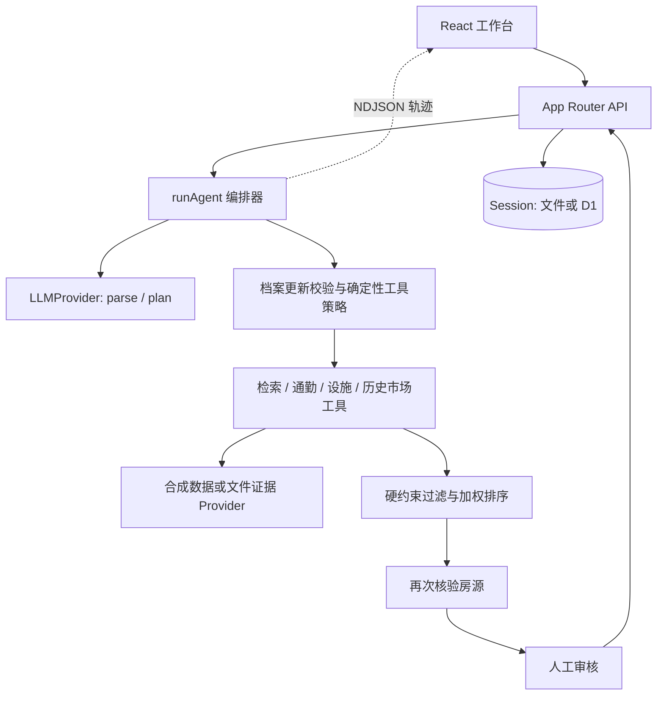

# 当前架构导读与优化切入点

分析日期：2026-09-25。代码基线：`main` / `a61673b7f52793f612b96e563dcc31f39c3615c6`。

本文根据源码静态分析整理；没有安装依赖、启动服务、重跑测试或验证远程部署。本次仅新增此说明，不修改应用行为。仓库已有评测报告属于历史证据。

## 1. 项目定位

PropMatch 是面向房产经纪人的买家需求匹配工作台。它把自然语言转成结构化买家档案，再检索房源、补充通勤与设施证据、执行硬约束检查、计算匹配分数，并交给经纪人审核。

当前实现是 **React 全栈单体应用 + 单个有状态编排器 + 确定性领域工具 + 可替换的数据/模型适配器**。`agents/` 下的文件是流程模块，不是多个独立模型代理。模型负责理解需求和提出工具计划；筛选、评分、解释与审批边界由代码控制。

## 2. 分层与入口

| 层 | 代码位置 | 主要职责 |
|---|---|---|
| 页面 | `app/page.tsx`、`components/workspace.tsx` | 聊天、档案、推荐、候选清单、对比、人工操作、执行轨迹 |
| 调试视图 | `components/debug.tsx`、`app/debug/`、`app/trace/` | 检查会话与轨迹 |
| HTTP | `app/api/`、`lib/http.ts`、`lib/request.ts` | 校验请求、获取会话、版本检查、调用流程、提交状态 |
| 流程 | `agents/orchestrator.ts` | 需求理解 → 校验 → 取证 → 排序 → 核验 → 等待审核 |
| 人工与刷新 | `agents/human.ts`、`verification.ts`、`refresh.ts` | 审批、拒绝、换备选、源数据核验与重新计算 |
| 领域规则 | `tools/index.ts`、`lib/profile*.ts` | 工具契约、硬约束、加权排序、比较、需求变更保护 |
| 模型接入 | `providers/contracts.ts`、`bedrock.ts`、`deepseek.ts`、`gateway.ts`、`demo-llm.ts` | 统一 `parse` / `plan` 接口与不同模型协议 |
| 证据接入 | `providers/evidence.ts`、`synthetic.ts`、`tools/market.ts` | 合成房源、文件快照、历史 HDB 交易 |
| 数据契约 | `schemas/index.ts` | Zod 校验及 TypeScript 类型，前后端共享 |
| 持久化 | `lib/store*.ts`、`db/schema.ts`、`drizzle/` | 文件或 D1 存储，版本化提交 |
| 质量与实验 | `tests/`、`evals/`、`training/` | 回归、场景评估、独立离线排序实验 |

## 3. 一次请求如何运行

1. 工作台读取或创建会话；服务端使用 HttpOnly Cookie 中的 UUID 定位 Session。
2. 用户提交 `message + version` 到 `/api/run`。服务端先拒绝过期版本。
3. `runAgent` 克隆旧 Session，为本轮生成 runId，清空旧候选清单，避免旧批准结果被继续使用。
4. `LLMProvider.parse(message, currentProfile)` 返回完整结构化档案。传入的是当前消息与档案，不是完整历史聊天或房源描述。
5. Zod、档案规范化、独立数值提取与硬约束变更检查共同校验模型输出。缺失、冲突或不支持的必选要求进入澄清状态。
6. 调用模型 `plan`，然后通过 `requiredPlan(profile)` 决定实际工具集合。
7. 先检索，再对初筛通过的房源补充所需通勤/设施，执行完整约束检查。
8. `rank_properties` 再次检查硬约束，计算预算、户型、通勤、交通、生活方式、区域与设施的加权平均分。分数是匹配度，不是概率。
9. 重新读取房源，剔除期间发生变化的条目；保留最多 8 个候选，初始清单取前 3 个。
10. API 将最终 Session 持久化成功后发送 `done`。执行过程发送的是 NDJSON 轨迹事件，不是模型文本逐 token 输出。

实现细节：`agents/orchestrator.ts:162–164` 中，`selected = required.tools`。模型提出的计划会记录在轨迹里，但不会改变实际工具选择。因此当前 `plan` 调用有延迟与成本，却不影响执行决策；是否保留应由产品对自主规划的真实需求决定。

## 4. 状态与人工决策

Session 同时容纳档案、消息、轨迹、带完整证据的推荐、清单、拒绝记录、数据修订号和状态。

| 状态 | 含义 |
|---|---|
| `empty` | 初始会话 |
| `clarification` | 需求不完整、冲突或不支持 |
| `waiting` | 候选已生成，等待人工审核 |
| `approved` | 经纪人已批准当前清单 |
| `no-match` | 无符合全部硬约束的房源 |
| `error` | 模型、工具或数据源失败 |

这些状态由多个函数赋值，尚未集中定义为状态迁移表。人工操作支持批准、拒绝、置顶、修改清单和选择替代清单；批准前会再次核验来源。批准仅记录决策，没有发送客户消息、预约或交易行为。

普通新对话会清空 `rejected`；数据刷新会保留它。如果希望“经纪人拒绝某房源后，后续对话也不再推荐”，需要先确定这项业务语义再修改。

前端可以启用可见页面每 30 秒刷新。`dataRevision` 未变则保留结果；变化时复用档案重新筛选，并撤销旧批准。此路径不调用模型 parse/plan；它不是服务端常驻监控，关闭页面后不会继续轮询。

## 5. 模型、数据与训练的真实边界

- 模型支持 `demo / gateway / deepseek / bedrock`；无配置时自动模式最终落到 demo。Demo 是规则解析器。
- 模型工厂 `getLLM` 放在 `providers/bedrock.ts`，但实际负责全部模型选择，文件职责与名称已有偏差。
- 默认房源是 72 条合成场景，路线和设施也属于演示数据。
- `DATA_MODE=file` 读取服务端配置的 JSON 证据快照，不是实时房产平台 API。房源、路线等带来源及有效期检查。
- 历史市场工具读取仓库内 7,295 条 HDB 成交记录，提供历史背景，不参与作为当前可售房源返回。
- 通勤目的地仍在编排器中对照 `synthetic.ts` 的固定字典校验，即使接入文件数据也受这个边界影响。
- Property 的内部 ID 被限制为 `PM-三位数字`，图片要求 `/images/` 本地路径；引入真实房源平台时需要调整内部标识和媒体契约。
- `training/` 是离线成对排序实验，使用合成偏好标签；主流程没有导入它，线上逻辑仍是规则加权排序。

## 6. 两套运行目标

| 目标 | 框架与构建 | 状态存储 | 注意事项 |
|---|---|---|---|
| Node / Docker / Lightsail | Next.js 16、React 19、`build:next`、standalone | 每个 Session 一个 JSON 文件 | 通过锁文件、原子 rename 与版本检查提交；Docker 挂载持久卷 |
| Sites / Cloudflare | Vinext、Vite、Workers | D1 的 `sessions(id, version, payload)` | Vite alias 将 `store-runtime` 替换成 D1 实现；使用带版本条件的 SQL 更新 |

两套存储都把完整 Session 当作一个文档保存。Drizzle 用于描述和生成 D1 表结构，运行时 D1 操作用的是 prepared statements。这里没有独立关系化的用户、房源、聊天或运行记录表。

`npm run dev/build` 默认走 Vinext/Vite 路径，`dev:next/build:next/start:next` 是单独的 Next 路径，`npm start` 则启动本地 Wrangler。理解脚本后再选择启动方式，避免混用构建产物。

文档差异：原 `docs/ARCHITECTURE.md` 开头仍写 AWS 尚未部署，而 README 和 `docs/DEPLOYMENT.md` 已记录 2026-09-22 的 Lightsail 部署验证。应将前者视为过时描述；本次没有访问线上服务，不能确认其当前状态。

## 7. 已有优点与主要优化机会

应保留的基础：Provider 接口、严格数据校验、模型不能放宽硬约束、证据来源与新鲜度检查、人工批准前重新核验，以及乐观并发控制。后续拆分不应丢失这些行为。

| 优先顺序 | 当前观察 | 建议与收益 |
|---|---|---|
| 第一批：明确边界 | 编排器约 379 行，混合档案更新、策略、取证、排名、轨迹和错误处理 | 提取档案更新服务、证据收集服务、推荐计算服务；编排器保留步骤协调 |
| 第一批：解耦演示实现 | 编排器依赖 `demo-llm` 的策略及解析锚点，还依赖 synthetic 目的地 | 将策略、独立需求校验、地点解析放入领域模块；演示 Provider 只实现适配 |
| 第一批：前端可维护性 | `workspace.tsx` 约 1,207 行，混合 API、轮询、状态和多个视图 | 提取会话/运行 hook，以及聊天、档案、候选和轨迹组件；先保持现有交互 |
| 第一批：规划取舍 | 模型计划不影响实际执行 | 若定位受控助手，默认由规则规划；若需要模型规划，定义允许调整的范围及回退策略 |
| 第二批：数据接入效率 | 房源与目的地循环串行；文件 Provider 每次 get/route/nearby 都重读并校验文件 | 使用一次运行内的数据快照、批量接口及有上限的并发；审批边界仍重新读取来源 |
| 第二批：持久化与故障恢复 | 每次写入完整 Session，轨迹随会话累积；运行结束才落盘 | 按规模拆分 Session 与运行事件，增加分页/保留策略；长任务再考虑持久运行状态 |
| 第二批：文件锁恢复 | `.lock` 依赖 finally 删除，进程崩溃可能留下锁文件 | 增加可验证的失效锁恢复机制，或统一迁移到支持事务的存储 |
| 产品化阶段 | 当前是 Cookie 会话与演示部署访问门禁，没有完整账号与租户模型 | 需要时增加用户/组织/买家归属、授权与配额；真实消息发送另建明确审批边界 |

串行取证和重复文件读取是代码可见的潜在瓶颈，并非本次压测结论。实际优先级应根据目标数据量、延迟和外部 API 限额决定。

当前规模适合继续采用模块化单体。优先理清内部模块和业务规则；只有出现独立扩缩容、后台持续任务或团队边界需求时，再决定是否拆服务或引入多代理。

## 8. 后续修改的验证基线

仓库已有 `node:test` 测试、确定性场景评估、模型接入验证以及两套构建的 CI。历史报告不能替代当前环境执行结果。动代码前建议先安装锁定依赖，建立本机基线：`npm run lint`、`npm run typecheck`、`npm test`、`npm run eval`，再验证选定部署目标的构建。

重点保留的行为：多轮需求保留、硬约束不可静默放宽、缺证据时的处理、来源变更撤销批准、并发版本冲突、流中断不显示成功。真实模型验证另行配置凭据，不把模型网络调用混入默认回归。

建议源码阅读顺序：`schemas/index.ts` → `agents/orchestrator.ts` → `tools/index.ts` → `providers/contracts.ts` 与 `providers/evidence.ts` → `agents/human.ts` / `refresh.ts` → `app/api/` 与 `lib/store*.ts` → `components/workspace.tsx`。
